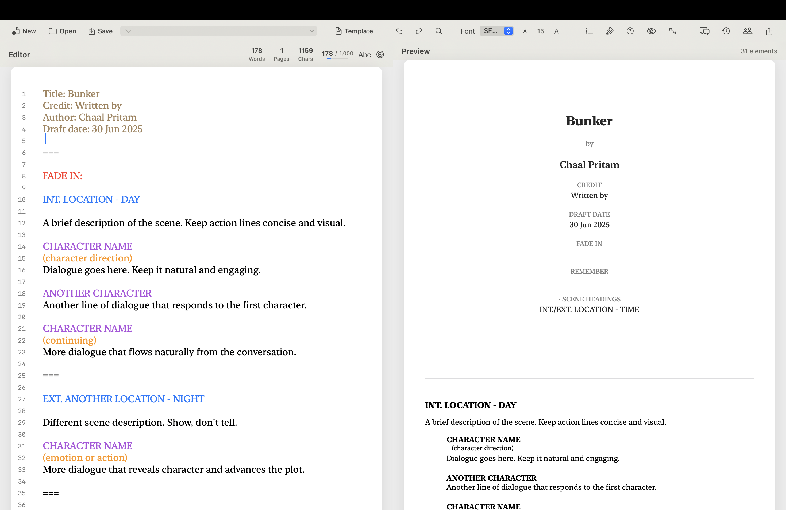

# Type

A modern, professional screenplay writing application for macOS with real-time Fountain format parsing, blockchain IP protection, and advanced collaboration features.



## Overview

**Type** is a next-generation screenplay editor built with SwiftUI, featuring a modular coordinator architecture, Apple-native design philosophy, and powerful tools for professional screenwriters. From solo writers to production teams, Type provides everything needed to craft, protect, and collaborate on screenplays.

## ✨ Key Features

### 🎬 Professional Screenplay Editor
- **Real-time Fountain parsing** with syntax highlighting and live preview
- **Split-view interface** with editor and formatted preview side-by-side
- **Professional formatting** with proper typography, spacing, and A4 paper styling
- **Advanced editor features**: auto-completion, smart formatting, find/replace, spell checking
- **Multiple cursors** for efficient batch editing
- **Code folding** for scene and section organization
- **Minimap view** for document overview and quick navigation
- **Undo/redo** with comprehensive history management

### 🎨 Modern TypeStyle Interface
- **Premium design** with vibrant gradients and glassmorphism effects
- **Smooth animations** and micro-interactions for enhanced UX
- **Dark mode support** with beautiful color schemes
- **Native macOS styling** following Apple's design guidelines
- **Customizable workspace** with resizable panels and layouts
- **Distraction-free writing mode** for focused creativity

### 🛡️ Story Protocol Integration (Blockchain IP Protection)
- **One-click IP protection** for your screenplays on blockchain
- **Network selection**: Switch between Mainnet and Testnet
- **Protection tracking**: View all protected assets with IP IDs and timestamps
- **Blockchain verification**: Links to blockchain explorer for authenticity
- See [`STORY_PROTOCOL_README.md`](docs/STORY_PROTOCOL_README.md) for details

### 👥 Character Management
- **Comprehensive character database** with profiles, photos, and descriptions
- **Character arc tracking** throughout your story
- **Relationship mapping** between characters
- **Dialogue analysis** and character statistics
- **Character search** and filtering capabilities

### 📝 Outline & Scene Management
- **Hierarchical outline mode** for document organization
- **Scene database** with metadata tracking
- **Visual timeline** for story structure
- **Drag-and-drop reordering** for scenes and sections
- **Scene statistics** and analysis tools

### 🤝 Collaboration Features
- **Real-time collaboration** with user management
- **Comments & replies** with resolution tracking
- **Version control** with ability to create, restore, and compare versions
- **Sharing & invites** with role-based permissions
- **Activity tracking** for team awareness

### 💾 File Management
- **Multi-window support** - Open multiple documents simultaneously in separate windows
- **Native macOS file operations** with proper permissions
- **Auto-save** every 30 seconds with recovery
- **Recent files** quick access
- **Export options**: PDF, Final Draft (.fdx), plain text (.fountain)
- **Template system** for TV pilots, features, and shorts

### ⌨️ Professional Workflow
- **Comprehensive keyboard shortcuts** (Cmd+S, Cmd+O, Cmd+N, Cmd+F, etc.)
- **Customizable animations** with speed controls
- **Writing goals** with daily word count targets and progress tracking
- **Statistics dashboard** with word count, page count, and analytics
- **Full-screen mode** for distraction-free writing

## Documentation

Comprehensive documentation is available in the `docs/` directory:

- [`docs/COMPREHENSIVE_DOCUMENTATION.md`](docs/COMPREHENSIVE_DOCUMENTATION.md) – Complete project overview and architecture
- [`docs/MODULAR_ARCHITECTURE.md`](docs/MODULAR_ARCHITECTURE.md) – Architecture design and patterns
- [`docs/MODULAR_IMPLEMENTATION_SUMMARY.md`](docs/MODULAR_IMPLEMENTATION_SUMMARY.md) – Implementation details
- [`docs/ADVANCED_EDITOR_FEATURES_SUMMARY.md`](docs/ADVANCED_EDITOR_FEATURES_SUMMARY.md) – Editor feature documentation
- [`docs/CHARACTER_DATABASE_README.md`](docs/CHARACTER_DATABASE_README.md) – Character system guide
- [`docs/MULTI_WINDOW_SUPPORT.md`](docs/MULTI_WINDOW_SUPPORT.md) – Multi-window functionality guide
- [`docs/STORY_PROTOCOL_INTEGRATION.md`](docs/STORY_PROTOCOL_INTEGRATION.md) – Blockchain integration details
- [`docs/IMPROVEMENT_TODO.md`](docs/IMPROVEMENT_TODO.md) – Development roadmap
- [`STORY_PROTOCOL_README.md`](STORY_PROTOCOL_README.md) – Quick start guide for IP protection

## 🏗️ Architecture

Type is built with a **modern, modular architecture** featuring a sleek TypeStyle interface and coordinator pattern that ensures scalability, maintainability, and clean separation of concerns:

```
TypeStyleAppView (Modern UI Container)
        ↓
AppCoordinator (Central State Manager)
        ↓
┌───────────┬──────────────┬───────────────┬──────────────┐
│  Editor   │  Characters  │   Outline     │ Collaboration │
│Coordinator│  Coordinator │  Coordinator  │  Coordinator  │
└───────────┴──────────────┴───────────────┴──────────────┘
```

**Key principles:**
- **Single Responsibility**: Each module handles one domain
- **Dependency Injection**: Services are injected into coordinators
- **Reactive Programming**: Combine framework for state management
- **Apple Guidelines**: Native macOS styling and behavior

See [`docs/MODULAR_ARCHITECTURE.md`](docs/MODULAR_ARCHITECTURE.md) for detailed architecture documentation.

## 🚀 Getting Started

### Quick Start
1. **Launch Type** and create a new document
2. **Choose a template** (Feature Film, TV Pilot, or Short) or start blank
3. **Write in Fountain** format - see syntax guide below
4. **Watch live preview** update in real-time as you type
5. **Save your work** (Cmd+S) - auto-save runs every 30 seconds
6. **Export** to PDF or Final Draft format when ready

### Protecting Your IP (Story Protocol)
1. **Select Network** in the toolbar (Testnet for testing, Mainnet for production)
2. **Click "Connect"** and wait for green connection indicator
3. **Click "Protect"** button (shield icon)
4. **Enter screenplay details** (title and author)
5. **Confirm protection** - your screenplay is now registered on blockchain!

See [`STORY_PROTOCOL_README.md`](STORY_PROTOCOL_README.md) for detailed IP protection guide.

## Example Fountain Script

```
Title: My First Screenplay
Author: Your Name
Draft: First Draft
:

# ACT ONE

= This is the beginning of our story

INT. COFFEE SHOP - DAY

Sarah sits at a corner table, typing furiously on her laptop.

SARAH
(without looking up)
I can't believe I'm finally writing this screenplay.

MIKE
(approaching)
Hey, Sarah! How's the writing going?

SARAH
(looking up, surprised)
Mike! I didn't expect to see you here.

> THE END <
```

## 📖 Fountain Syntax Reference

Type supports the complete Fountain screenplay format:

| Element | Syntax | Example |
|---------|--------|---------|
| **Scene Heading** | `INT./EXT. LOCATION - TIME` | `INT. COFFEE SHOP - DAY` |
| **Character** | `ALL CAPS NAME` | `SARAH` |
| **Dialogue** | Text after character name | `Hello, world!` |
| **Parenthetical** | `(direction)` | `(without looking up)` |
| **Action** | Regular text | `Sarah sits at a table.` |
| **Transition** | `TRANSITION:` or `> TRANSITION TO:` | `CUT TO:` |
| **Section** | `# Section Name` | `# ACT ONE` |
| **Synopsis** | `= synopsis` | `= This is the beginning` |
| **Note** | `[[note]]` | `[[private note]]` |
| **Centered** | `> text <` | `> THE END <` |
| **Page Break** | `===` | `===` |
| **Emphasis** | `*italic*` `**bold**` `***bold-italic***` | `*sigh*` |
| **Forced Elements** | `!` for scene, `@` for character | `!SCENE HEADING` |
| **Dual Dialogue** | Character name with `^` | `SARAH^` |

### Advanced Syntax
- **Force scene heading**: `!INT. LOCATION - DAY`
- **Force character**: `@CHARACTER`
- **Lyrics**: `~This is a song~`
- **Title page**: Key-value pairs at document start (Title:, Author:, etc.)

## 🛠️ Technical Stack

- **SwiftUI** - Modern macOS interface framework
- **Combine** - Reactive state management
- **Fountain Format** - Industry-standard screenplay markup
- **Story Protocol** - Blockchain IP protection (simulated, Web3 integration pending)

## 📊 Project Status

### ✅ Completed Features
- ✅ **Core Editor**: Real-time parsing, syntax highlighting, live preview
- ✅ **Advanced Editor**: Auto-completion, multiple cursors, code folding, find/replace
- ✅ **Modern TypeStyle UI**: Premium design with gradients, glassmorphism, smooth animations
- ✅ **File Management**: Save/load, auto-save, export (PDF/FDX), templates
- ✅ **Character System**: Database, profiles, arcs, relationships, dialogue analysis
- ✅ **Outline & Scenes**: Hierarchical organization, scene tracking, timeline view
- ✅ **Collaboration**: Real-time editing, comments, version control, sharing
- ✅ **Story Protocol**: Blockchain IP protection UI and flow (simulated)
- ✅ **Productivity**: Writing goals, statistics, keyboard shortcuts

### 🚧 In Development
- Enhanced FDX export with advanced features
- iCloud sync for cross-device access
- Performance optimization for large documents
- Revision marking system
- Advanced statistics and analytics

### 📋 Roadmap
See [`docs/IMPROVEMENT_TODO.md`](docs/IMPROVEMENT_TODO.md) for the complete development roadmap including:
- Phase 1: Core competitiveness (Enhanced parser, professional export, advanced outlining)
- Phase 2: Professional features (Revision management, advanced statistics, plugin system)
- Phase 3: Advanced features (Focus mode, production features, advanced collaboration)
- Phase 4: Platform expansion (iOS app, web version, cross-platform support)

## 🔧 Build & Installation

### Prerequisites
- macOS 12.0 or later
- Xcode 14.0 or later
- Swift 5.7 or later

### Building from Source
```bash
# Clone the repository
git clone https://github.com/yourusername/type.git
cd type

# Open in Xcode
open type.xcodeproj

# Build and run (Cmd+R)
```

### Automated Build Script
```bash
# Run the build and install script
./build_and_install.sh
```

### Creating a DMG Installer
```bash
# Create a distributable DMG installer
./create_dmg.sh

# Create DMG with clean build
./create_dmg.sh -c

# Create DMG and keep build artifacts
./create_dmg.sh -k
```

The DMG installer allows users to easily download and install Type by dragging it to their Applications folder. The script automatically:
- Builds the app in Release configuration
- Creates a professional DMG with custom layout
- Includes an Applications folder symlink for easy installation
- Compresses the DMG for optimal file size

See [`docs/BUILD_INSTALL.md`](docs/BUILD_INSTALL.md) for detailed build instructions.

## 🧪 Testing

Run the included test scripts to verify functionality:
```bash
./test_app.sh                      # Test main application
./test_character_database.sh       # Test character system
./test_modular_architecture.sh     # Test architecture
./test_outline_mode.sh             # Test outline features
```

## 🤝 Contributing

Contributions are welcome! This project follows:
- **Swift style guidelines** and best practices
- **Coordinator pattern** for feature modules
- **Apple design guidelines** for UI/UX
- **Comprehensive documentation** for all changes

See [`docs/COMPREHENSIVE_DOCUMENTATION.md`](docs/COMPREHENSIVE_DOCUMENTATION.md) for architecture details.

## 📝 License

MIT License - feel free to use and modify as needed.

## 🙏 Acknowledgments

- **Fountain Format** - The wonderful open screenplay markup language
- **Story Protocol** - Blockchain IP protection infrastructure
- **Apple Design** - Inspiration for the beautiful native macOS interface

---

**Happy screenwriting!** 🎬✨

---

## 📞 Support & Resources

- **Documentation**: See `/docs` directory for comprehensive guides
- **Story Protocol**: https://docs.story.foundation
- **Fountain Format**: https://fountain.io
- **Issues**: Report bugs or request features via GitHub Issues

**Built with ❤️ for screenwriters by screenwriters.**

